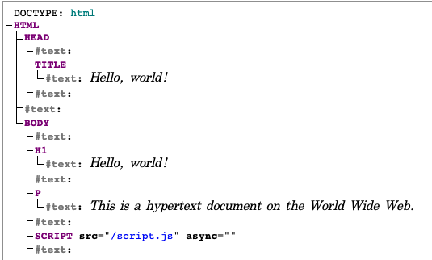

# DOM에 관하여

Created: February 3, 2022 11:15 PM
작성상태: 작성 중
주제: HTML
카테고리: FrontEnd

## DOM이란 무엇인가?

Document Object Model로, 문서 객체 모델이라고 부른다.

- Document - 파일(HTML, XML)
- Object - Tag, elements
- Model - layout, structure

> DOM은 HTML,XML같은 파일의 Tag,element 모델이다.
> 

> DOM을 DOM tree 라고 많이 부른다.
> 

## DOM은 어떻게 생기는가?

HTML을 브라우저가 파싱(parse)을 하여 DOM tree를 만듭니다.

```html
<!doctype html>
<html>
  <head>
    <title>Hello, world!</title>
  </head>
  <body>
    <h1>Hello, world!</h1>
    <p>This is a hypertext document on the World Wide Web.</p>
    <script src="/script.js" async></script>
  </body>
</html>
```

위의 HTML코드를 브라우저가 파싱하여 아래와 같은 DOM tree를 만듭니다.

```
html
  head
    title
  body
    h1
    p
    script
```

파싱 결과로 여러개의 노드들로 이루어진 DOM Tree가 생깁니다.

브라우저마다 DOM Tree 생성방식이 다를 수 있습니다.

## 왜 DOM을 쓰는가?

DOM은 HTML, XML의 구조를 프로그래밍적으로 read, access, update 를 쉽게 할수있게합니다.

DOM은 Document를 프로그래밍으로 쉽게 사용하기 위한 API 입니다

## DOM을 프로그래밍적으로 어떻게 사용하는가?

JS로 document.getElementByTagName(”title”) 이런식으로 DOM 을접근할수 있는 함수들이 구현되어있습니다.

## 좀더 깊게 Node

DOM tree는 Node로 구성되어있다. Node는 무엇일까?

[live-dom-viwer](https://software.hixie.ch/utilities/js/live-dom-viewer/) 에서 볼수있습니다.



노드들에 대해서는 [MDN Node](https://developer.mozilla.org/ko/docs/Web/API/Node) 에서 볼수있습니다.

기본적으로 Node 인터페이스를 구현한 DOM 타입 인터페이스들을 나열해보면 아래와 같습니다

| 이름 | 설명 |
| --- | --- |
| Document | DOM 트리의 진입점 역할을 합니다.
제공되는 문서에 따라 HTMLDocument, XMLDocument을 구현합니다. |
| Element | Doucment 안에 모든 노드(객체)가 상속하는 범용적인 클래ㄱ스입니다. HTMLElement, SVGElement등이 있습니다. |
| CharacterData | 추상 인터페이스이고 문자를 포함하는 Node 객체를 나타냅니다. Text, Comment, ProcessingInstruction 이 있습니다. |
| ProcessingInstruction | XML에서 지원하는 인터페이스로, 특정 응용프로그램을 대상으로 하는 명령을 포함합니다. |
| DocumentFragment | 아주 작은 document객체를 나타냅니다.
이 documentFragment에 DOM 하위트리를 조립하고 document에 appendChild, insertBefore와 같은 방법으로 Node 에 추가하면 한번의 리플로우와 리드로우로 처리할수있다.

웹 컴포넌트를 사용할때 유용합니다. |
| DocumentType | doctype을 포함하는 Node를 나타냅니다. |

> Node는 EventTarget을 로부터 프로퍼티를 상속한다.
> 

## EventTarget?

이벤트를 수신할수 있고, 수신한 이벤트에 대한 listener를 가질수 있는 객체를 구현하는 인터페이스입니다.

Element, Document, window, XMLHttpRequest, AudioNode, AudioContext 가 있습니다.

## DOM에 대해 공부 한 후

이전에 공부했던 HTML이 이렇게 깊은 내용이 있을 줄 몰랐습니다.

단순 마크업이 아닌 프로그래밍 가능한 DOM tree로 바뀌고 우리는 JS로 컨트롤 할수 있는것이라는걸 알수 있었습니다.

github가 사용하는 웹 컴포넌트 또한 이 DOM tree의 개념을 기반으로 만든것임을 알수 있었고, react같은 virtual dom이 아닌 DocumentFragment를 활용해 virtual dom 처럼 사용할수 있는것도 알수 있는 공부였습니다.

다음은 DOM Event나 모던 웹사이트에 대해 공부해보고 정리해보겠습니다

---

참고

[https://developer.mozilla.org/ko/docs/Web/API/Document_Object_Model/Introduction#dom_and_javascript](https://developer.mozilla.org/ko/docs/Web/API/Document_Object_Model/Introduction#dom_and_javascript)

[https://www.youtube.com/watch?v=ipkjfvl40s0](https://www.youtube.com/watch?v=ipkjfvl40s0)

[https://www.youtube.com/watch?v=FIORjGvT0kk&list=PL4cUxeGkcC9gfoKa5la9dsdCNpuey2s-V](https://www.youtube.com/watch?v=FIORjGvT0kk&list=PL4cUxeGkcC9gfoKa5la9dsdCNpuey2s-V)

[https://developer.chrome.com/docs/devtools/dom/#appendix](https://developer.chrome.com/docs/devtools/dom/#appendix)